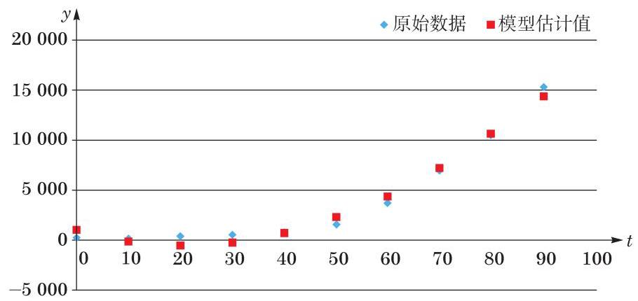

# 方法卡：模型检验

为检验所建模型能否较好地体现这两个变量之间的关系, 较为常见的方法有:

方法 1: 比对所建模型的图形与原始数据的形态;

方法 2:计算误差值并绘制相应的误差分布图，以检验模型估计值是否与原始数据 (即实际观测值)拟合良好.

这里先选用方法 1 ，以春季为例，比对所建模型的图形与原始数据的形态. 观察图4-5，模型估计值(红色)与原始数据(蓝色)在总体上还是较为贴合的. 但同时发现，在 $t = {10}$ 、 20 和 30 时,模型估计值呈不应出现的负值,且当 $t = 0$ 时,绝对差值达到 774.186 . 这提示我们, 可能需要对这一函数模型进行调整.

