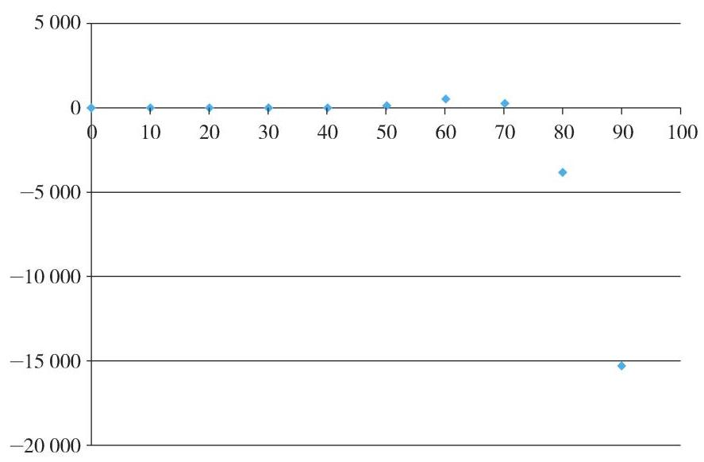

# 方法卡：模型再检验

现在我们选用方法 2 ，计算误差值并绘制出相应的误差分布图，对指数函数模型的拟合程度进行鉴定. 图 4-8 显示, 模型估计值与实际观测值在前 70 天差距甚微, 而之后的估计值则与实际观测值产生了较大的偏差.

显然,70 天之后的模型估计值要远大于实际观测值,特别是当 $t = {90}$ 时. 事实上,许多生物种群在繁殖之初, 由于种群数量较少, 增长速度较快, 确实会呈指数形式增长. 但随着时间的推移，当种群数量达到环境资源所能容纳的最大数量时，种群数量的增长速度会越来越慢, 最终几乎停止增长.

数学生物学家韦吕勒(P. F. Verhulst)针对此现象, 在 1838 至 1847 年间对指数增长模型进行了调整, 提出了著名的逻辑斯蒂函数(Logistic Function)模型

$$
y = \frac{A}{1 + {\mathrm{e}}^{b - {kt}}},
$$

其中, $k$ 为增长率, $b$ 为常数.

该模型的计算相对复杂, 但选用恰当的电脑软件, 就可以得到水葫芦在春、夏、秋三个季节的逻辑斯蒂函数模型分别为:

春季: $y = \frac{23005.460}{1 + {\mathrm{e}}^{{6.402} - {0.078t}}},0 \leq t \leq {90}$ ;

夏季: $y = \frac{39605.959}{1 + {\mathrm{e}}^{{6.254} - {0.070t}}},0 \leq t \leq {90}$ ;

秋季: $y = \frac{14499.129}{1 + {\mathrm{e}}^{{6.446} - {0.076t}}},0 \leq t \leq {90}$ .

以春季的增长模型为例, 通过检验发现, 逻辑斯蒂函数模型所对应的绝对误差介于 13.075 和 383.801 之间, 指数函数模型的误差介于 4.69 和 15252.60 之间, 而二次函数模型的误差介于 89.154 和 774.186 之间. 显然, 在这三种函数模型中, 逻辑斯蒂函数模型能更准确地反映水葫芦的生长规律.

至此, 请同学们撰写建模活动报告, 记录整个研究的过程.
