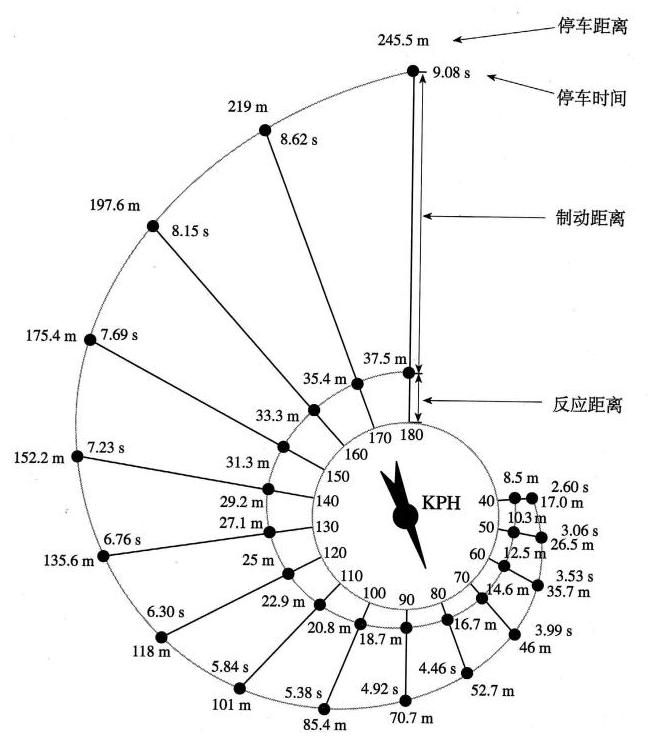

# 概念卡：求解模型

为了估计急刹车时的刹车距离模型中的参数, 需要通过试验得到实际数据. 表 1-1 是美国公路局公布的试验数据(数据引自吉奥丹诺等所著《数学建模》 ${}^{\left\lbrack 1\right\rbrack }$ ，原始数据的单位是英里、英尺,此处把距离单位换算为千米、米, $\alpha \text{ 、 }\beta$ 值也作了相应的调整).

表 1-1 通过试验观测到的反应距离、制动距离与刹车距离

<table id="cross-table-1"><tr><td>$v/\left( {\mathrm{{km}} \cdot {\mathrm{h}}^{-1}}\right)$</td><td>${d}_{1}/\mathrm{m}$</td><td>${d}_{2}/\mathrm{m}$</td><td>$d/\mathrm{m}$</td><td>$\alpha$</td><td>$\beta$</td></tr><tr><td>32</td><td>6.7</td><td>6.1</td><td>12.8</td><td>0.209</td><td>0.00596</td></tr><tr><td>40</td><td>8.5</td><td>8.5</td><td>17.0</td><td>0.213</td><td>0.00531</td></tr><tr><td>48</td><td>10.1</td><td>12.3</td><td>22.4</td><td>0.210</td><td>0.00534</td></tr><tr><td>56</td><td>11.9</td><td>16.0</td><td>27.9</td><td>0.213</td><td>0.00510</td></tr><tr></tr><tr><td>64</td><td>13.4</td><td>21.9</td><td>35.3</td><td>0.209</td><td>0.00535</td></tr><tr><td>72</td><td>15.2</td><td>28.2</td><td>43.4</td><td>0.211</td><td>0.00544</td></tr><tr><td>80</td><td>16.7</td><td>36.0</td><td>52.7</td><td>0.209</td><td>0.00563</td></tr><tr><td>89</td><td>18.6</td><td>45.3</td><td>63.9</td><td>0.209</td><td>0.00572</td></tr><tr><td>97</td><td>20.1</td><td>55.5</td><td>75.6</td><td>0.207</td><td>0.005 90</td></tr><tr><td>105</td><td>21.9</td><td>67.2</td><td>89.1</td><td>0.209</td><td>0.006 10</td></tr><tr><td>113</td><td>23.5</td><td>81.0</td><td>104.5</td><td>0.208</td><td>0.006 34</td></tr><tr><td>121</td><td>25.3</td><td>96.9</td><td>122.2</td><td>0.209</td><td>0.00662</td></tr><tr><td>128</td><td>26.8</td><td>114.6</td><td>141.4</td><td>0.209</td><td>0.006 99</td></tr></table>

通过关系式②和③，可以计算出表 1-1 每一行中相应的 $\alpha$ 和 $\beta$ 值. 它们的平均数分别为 $\overline{\alpha } = {0.210},\overline{\beta } = {0.00583}$ ,可取它们为参数 $\alpha \text{ 、 }\beta$ 的估计值. 代入关系式④,就得到刹车距离模型

$$
d = {0.210v} + {0.00583}{v}^{2}.
$$

由此得到汽车刹车距离关于汽车速度的二次函数关系.

为了便于查阅, 除了构建模型、制作表格, 人们也会给出一些直观的图形. 图 1-1 直观地给出了急刹车的刹车距离模型.

图 1-1 刹车距离示意图

(本图表及所附数据摘自《普通高中数学课程标准(2017 年版 2020 年修订)》第 119 页)
