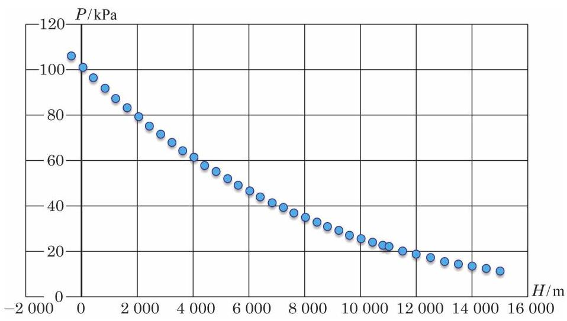
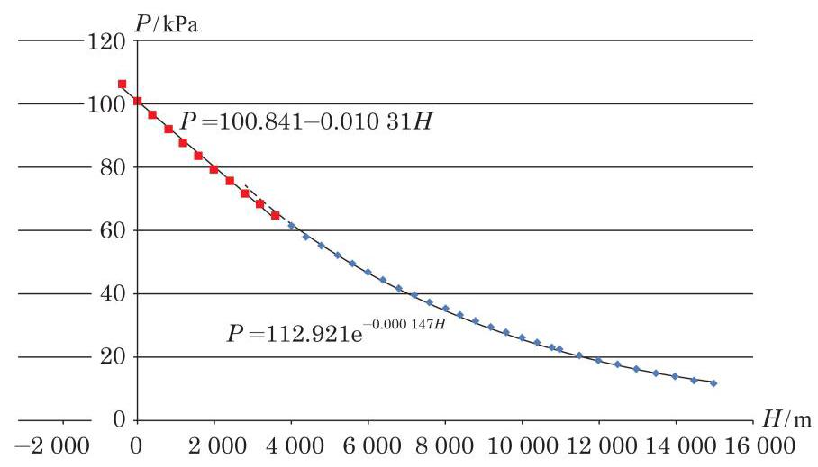

# 概念卡：模型的拓展

同学们一定发现:由于表 3-1 与表 3-2 中海拔 3600 m 以上的数据很少，我们无法从中获取较高海拔地区大气压变化的状况, 从而也无法回答一开始关于珠峰含氧量的问题. 我们要寻找更多的数据, 并进一步探究海拔高度与大气压的关系.

由于高海拔地区城市很少, 因此再以城市为标志给出海拔高度与大气压的数据是不现实的. 我们通过网络查询找到另一个数据表, 它以基本等距的方式标注海拔高度与大气压的对照情况. 我们从中选取数据, 列成表 3-4.

表 3-4

<table id="cross-table-2"><tr><td>海拔高度/m</td><td>大气压/kPa</td><td>海拔高度/m</td><td>大气压/kPa</td></tr><tr><td>-400</td><td>106.22</td><td>6400</td><td>44.65</td></tr><tr><td>0</td><td>101.33</td><td>6800</td><td>42.23</td></tr><tr><td>400</td><td>96.61</td><td>7 200</td><td>39.92</td></tr><tr><td>800</td><td>92.08</td><td>7 600</td><td>37.71</td></tr><tr><td>1200</td><td>87.72</td><td>8000</td><td>35.60</td></tr><tr><td>1600</td><td>83.52</td><td>8400</td><td>33.59</td></tr><tr><td>2000</td><td>79.50</td><td>8800</td><td>31.67</td></tr><tr><td>2400</td><td>75.63</td><td>9200</td><td>29.84</td></tr><tr><td>2800</td><td>71.91</td><td>9600</td><td>28.10</td></tr><tr><td>3200</td><td>68.34</td><td>10000</td><td>26.44</td></tr><tr><td>3600</td><td>64.92</td><td>10400</td><td>24.86</td></tr><tr><td>4000</td><td>61.64</td><td>10800</td><td>23.36</td></tr><tr><td>4400</td><td>58.49</td><td>11000</td><td>22.63</td></tr><tr><td>4800</td><td>55.48</td><td>11500</td><td>20.92</td></tr><tr><td>5200</td><td>52.59</td><td>12000</td><td>19.33</td></tr><tr><td>5600</td><td>49.83</td><td>12500</td><td>17.87</td></tr><tr><td>6000</td><td>47.18</td><td>13000</td><td>16.51</td></tr><tr></tr><tr><td>13500</td><td>15.26</td><td>14500</td><td>13.03</td></tr><tr><td>14000</td><td>14.10</td><td>15000</td><td>12.05</td></tr></table>

数据来源:海拔高度信息查询工具.

表 3-4 包括了从 $- {400}\mathrm{\;m}$ 到 ${15000}\mathrm{\;m}$ 范围内的海拔高度与大气压对照的抽样数据,其中 ${11000}\mathrm{\;m}$ 以下按 ${400}\mathrm{\;m}$ 间隔取样, ${11000}\mathrm{\;m}$ 以上按 ${500}\mathrm{\;m}$ 间隔取样.

根据表 3-4 中的数据作散点图 (图 3-2).

请同学们考察此散点图, 把你的发现和对如何作拟合的设想填入下框.

从散点图可以看出，在低海拔区域(3600 m以下)数据点基本是线性分布的，而到高海拔区域数据点就明显偏离了线性分布，呈现出指数分布的性态. 为此，我们把数据点分成两部分进行分段拟合: 海拔 ${3600}\mathrm{\;m}$ 及以下的点作线性拟合 (这也与我们前面得到的经验相符),海拔 ${3600}\mathrm{\;m}$ 以上的点作指数拟合. 为了使线性拟合与指数拟合有较平滑的衔接,把对应海拔 ${2800}\mathrm{\;m}\text{ 、 }{3200}\mathrm{\;m}$ 和 ${3600}\mathrm{\;m}$ 的三个数据点加入到指数拟合中. 由此,我们得到了关于海拔高度 $H$ 与相应大气压 $P$ 的拟合模型

$$
P = \left\{ \begin{array}{ll} {100.841} - {0.01031H}, & - {400} \leq H \leq {3600}, \\ {112.921}{\mathrm{e}}^{-{0.000147H}}, & H > {3600}. \end{array}\right.
$$

③

拟合曲线的图像如图 3-3 所示.

