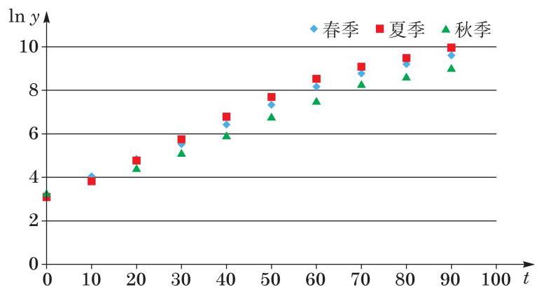
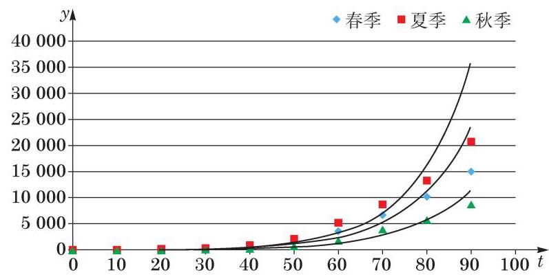

# 概念卡：模型改进

观察图 4-1,水葫芦的植物量 $y$ 与时间 $t$ 可能呈现出某种指数函数关系. 为了验证这一猜测,我们首先对植物量 $y$ 取对数,再建立 $\ln y$ 与 $t$ 的函数关系. 由图 4-6 可以明显看出, $\ln y$ 与 $t$ 之间存在着某种线性关系.

利用最小二乘估计 (参见选择性必修课程第 8 章),我们可以建立 $\ln y$ 与 $t$ 之间的一元线性回归模型: $\ln y = {at} + b$ ,其中 $a$ 和 $b$ 是待定系数. 记 $\ln y$ 为 $s\left( {\text{ 即 }s = {at} + b}\right)$ ,可得三个季节中 $s$ 与 $t$ 的线性拟合模型: 春季为 $s = {0.0803t} + {3.27}$ ,夏季为 $s = {0.0743t} + {3.39}$ , 秋季为 $s = {0.0686t} + {3.19}$ . 将这些函数还原为指数函数,就可以分别得到: 春季的生长模型为 $y = {26.3} \times {1.08}^{t}$ ,夏季的生长模型为 $y = {29.7} \times {1.08}^{t}$ ,秋季的生长模型为 $y = {24.3} \times {1.07}^{t}$ (图 4-7).

