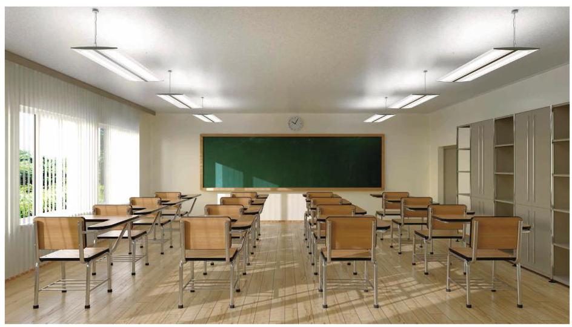

# 概念卡：9 教室里的照明

日光灯所发出的白光是多种频率的光线的混合, 所发的光基本上是均匀的, 因此教室照明较多选用日光灯. 如何安装教室里的日光灯是大有讲究的宝 安装数量过多, 不仅浪费资源，还会造成眩光，影响学生的视力；安装数量太少，教室里照明度不够，同样会影响学生的视力.

新近出台的国家标准《中小学校普通教室照明设计安装卫生要求》(以下简称《要求》)于 2019 年 4 月正式实施. 《要求》对教室桌面、黑板面的照度和教室照明的设计安装进行了详细规定，有助于更科学合理地保护青少年视力. 《要求》规定:教室桌面维持平均照度不低于 300 lx(勒克斯，照度的国际单位)，照度均匀度不低于 0.7；黑板面维持平均照度不低于 ${500}\mathrm{{lx}}$ ,照度均匀度不低于 0.8 .

在教室照明的设计安装上，《要求》建议采用悬挂式格栅灯具，黑板照明灯具应采用有非对称光强分布特性的专用黑板灯具. 灯具应采用吊杆安装方式, 其中桌面照明灯具长轴应垂直于黑板且均匀分布, 灯具距课桌垂直距离不低于 1700 mm. 而黑板灯应平行于黑板安装，距黑板平行间距应为 ${700} \sim {1000}\mathrm{\;{mm}}$ ，距黑板上缘垂直距离应为 ${100} \sim {200}\mathrm{\;{mm}}$ .

理解这些要求, 了解灯管与配套设施的技术参数, 为教室设计照明方案, 包括所需安装的日光灯管数量和布局. 教室里应该安装多少盏日光灯才比较合理？应如何布局才能达到照明要求？

