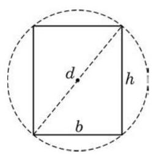

# 例题卡：例 12 已知某商品的成本 $C$ 与产量 $q$ 满足函数关系 $C = \; C\left( q\right)$ ,其中 $C\left( q\right)  = {100} + \frac{1}{4}{q}^{2}$ ,并定义平均成本为 $\bar{C} = \bar{C}\left( q\right)$ , 其中 $\bar{C}\left( q\right)  = \frac{C\left( q\right) }{q}$ .

例 12 已知某商品的成本 $C$ 与产量 $q$ 满足函数关系 $C = \; C\left( q\right)$ ,其中 $C\left( q\right)  = {100} + \frac{1}{4}{q}^{2}$ ,并定义平均成本为 $\bar{C} = \bar{C}\left( q\right)$ , 其中 $\bar{C}\left( q\right)  = \frac{C\left( q\right) }{q}$ .

---

经济学中通常将 ${C}^{\prime }\left( q\right)$ 称为边际成本, 它代表产量为 $q$ 时, 增加单位产量需付出的成本增加量.

---

(1)比较 ${C}^{\prime }\left( {10}\right)$ 和 ${C}^{\prime }\left( {20}\right)$ ,解释两者的大小代表了怎样的实际意义；

(2)当产量为多少时，平均成本最少？

解(1)因为 ${C}^{\prime }\left( q\right)  = \frac{1}{2}q$ ,所以 ${C}^{\prime }\left( {10}\right)  = 5,{C}^{\prime }\left( {20}\right)  = {10}$ , 有 ${C}^{\prime }\left( {10}\right)  < {C}^{\prime }\left( {20}\right)$ .

${C}^{\prime }\left( {10}\right)  = 5$ 代表当产量为 $q = {10}$ 时,增加单位产量需付出的成本增加量为 5 ; 而 ${C}^{\prime }\left( {20}\right)  = {10}$ 代表当产量为 $q = {20}$ 时,增加单位产量需付出的成本增加量为 10 .

(2)平均成本 $\bar{C}\left( q\right)  = \frac{C\left( q\right) }{q} = \frac{100}{q} + \frac{q}{4},{\bar{C}}^{\prime }\left( q\right)  =  - \frac{100}{{q}^{2}} + \frac{1}{4}$ .

令 ${\bar{C}}^{\prime }\left( q\right)  = 0$ ,得 ${q}^{2} = {400}$ ,根据实际意义,可知 $q > 0$ ,因此, $q = {20}$ 是其驻点.

当 $0 < q < {20}$ 时, ${\bar{C}}^{\prime }\left( q\right)  < 0$ ,函数 $\bar{C} = \bar{C}\left( q\right)$ 严格减; 而当 $q >$ 20 时, ${\bar{C}}^{\prime }\left( q\right)  > 0$ ,函数 $\bar{C} = \bar{C}\left( q\right)$ 严格增. 因此,当产量 $q = {20}$ 时, 平均成本最少.

解 根据题意,可知 ${h}^{2} = {d}^{2} - {b}^{2}$ ,所以 $W\left( b\right)  = \frac{1}{6}b\left( {{d}^{2} - {b}^{2}}\right)$ , $0 < b < d$ .

