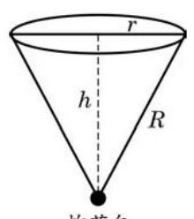

# 练习卡：练习 5.3(4)

1. 某商品的成本 $C$ 和产量 $q$ 满足函数关系 $C = {50000} + {200q}$ ,该商品的销售单价 $p$ 和产量 $q$ 满足函数关系 $p = {24200} - \frac{1}{5}{q}^{2}$ . 问: 要使利润最大, 应如何确定产量?

(第 2 题)

2. 采矿、采石或取土时，常用炸药包进行爆破，部分爆破呈圆锥漏斗形状 (如图), 已知圆锥的母线长是炸药包的爆破半径 $R$ , 它的值是固定的. 问:炸药包埋多深可使爆破体积最大？
