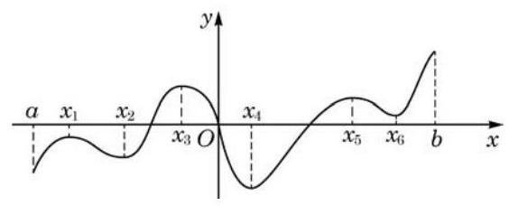
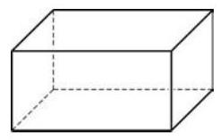

# 概念卡：习题 5.3

##### A 组

1. 利用导数研究下列函数的单调性, 并说明结果与你之前的认识是否一致:

(1) $y = {\left( \frac{1}{\mathrm{e}}\right) }^{x}$ ; (2) $y = {\log }_{\frac{1}{\mathrm{e}}}x$ .

2. 利用导数判断函数 $y = \frac{1}{\cos x}, x \in  \left( {-\frac{\pi }{2},\frac{\pi }{2}}\right)$ 的单调性,并求出极值.

3. 某函数图像如图所示,它在 $\left\lbrack  {a, b}\right\rbrack$ 上哪一点取得最大值? 它是极大值点吗? 在哪一点取得最小值? 它是极小值点吗?

(第 3 题)

4. 求下列函数的单调区间、极值点和极值:

(1) $y = {x}^{2} + {2x} + {3;}$ (2) $y = x + \frac{1}{x}$ ；

(3) $y = {3x} - {x}^{3}$ ； (4) $y = {x}^{2}{\mathrm{e}}^{x}$ .

5. 证明: 函数 $y = {x}^{3} + {4x}$ 在 $\left( {-\infty , + \infty }\right)$ 上严格增.

6. 求函数 $y =  - {x}^{3} + {12x} - 1$ 的单调减区间.

7. 证明: 函数 $y = x - \frac{1}{x}$ 没有极值点.

8. 求函数 $y =  - {x}^{3} + {12x} - 1, x \in  \left\lbrack  {0,3}\right\rbrack$ 的值域.

##### B 组

1. 判断下列函数在 $\left( {-\infty , + \infty }\right)$ 上是否存在驻点,是否存在极值点,并说明理由:

(1) $y = {x}^{n}$ ， $n$ 为正奇数； (2) $y = {x}^{n}$ ， $n$ 为正偶数.

2. 已知函数 $y = {x}^{3} + {2m}{x}^{2} - {nx} + m$ 在 $x = 1$ 处有极值 0,求 $m + n$ 的值.

3. 用长为 ${18}\mathrm{\;m}$ 的钢条制作一个如图所示的长方体框架. 已知长方体的长宽比为 $2 : 1$ ，间:该长方体的长、宽、高各为多少时，其体积最大? 最大体积是多少?

(第 3 题)

4. 某分公司经销一品牌产品, 每件产品的成本为 4 元, 且每件产品需向总公司交 3 元的管理费,预计当每件产品的售价为 $x$ 元 $\left( {8 \leq  x \leq  {11}}\right)$ 时,一年的销售量为 ${\left( {12} - x\right) }^{2}$ 万件. 问: 当每件产品的售价为多少元时,该分公司一年的利润 $L$ 最大?(结果精确到 1 元)
