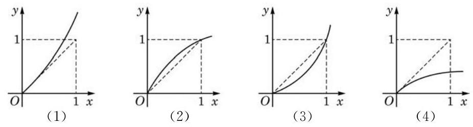

# 例题卡：例 5 已知在区间 $\left( {0,1}\right)$ 上 ${f}^{\prime }\left( x\right)  > 1$ . 在图 5-3-1 所示的图像中,哪些有可能表示函数 $y = f\left( x\right)$ ? 为什么?

例 5 已知在区间 $\left( {0,1}\right)$ 上 ${f}^{\prime }\left( x\right)  > 1$ . 在图 5-3-1 所示的图像中,哪些有可能表示函数 $y = f\left( x\right)$ ? 为什么?

解 在区间 $\left( {0,1}\right)$ 上,因为 ${f}^{\prime }\left( x\right)  > 1$ ,所以函数图像中每一点处切线的斜率都应大于 1 . 在图 5-3-1 中，由观察可知:

图(1)中的曲线越来越“陡峭”，在区间 $\left( {0,1}\right)$ 上各点处的切线斜率始终大于 1 ;

图(2)中的曲线由“陡峭”变得“平缓”，在区间 $\left( {0,1}\right)$ 的右半段的切线斜率小于 1 ;

图(3)中的曲线由 “平缓” 变得 “陡峭”，在区间 $\left( {0,1}\right)$ 的左半段的切线斜率小于 1 ;

图(4)中的曲线越来越“平缓”，在区间 $\left( {0,1}\right)$ 上各点处的切线斜率始终小于 1 .

因此,只有图 5-3-1(1) 中的图像有可能表示函数 $y = f\left( x\right)$ .
