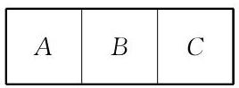

# 方法卡：A 组

1. 如图,用 6 种不同的颜色将 $A\text{ 、 }B\text{ 、 }C$ 三个区域涂色,每个区域涂上一种颜色,且有公共边的区域不能涂同一种颜色. 问: 不同的涂色方法共有多少种?

(第 1 题)

2.5 个工程队分别承建某项工程的 5 个不同的子项目, 每个工程队各承建其中的 1 项, 且甲工程队不能承建 1 号子项目. 问: 不同的承建方案有多少种?

3. 从 0、1、2、3、4、5 六个数字中任取四个数字，可以组成多少个没有重复数字、 且为奇数的四位数?

4. 解关于正整数 $x$ 的方程: ${11}{C}_{x}^{3} = {24}{C}_{x + 1}^{2}$ .

5. 已知 ${\left( {x}^{2} + \frac{1}{x}\right) }^{n}$ 的二项展开式的各项系数之和为 32,求该二项展开式中 $x$ 的系数.

6. 若 ${\left( 1 - 2x\right) }^{4} = {a}_{0} + {a}_{1}x + {a}_{2}{x}^{2} + {a}_{3}{x}^{3} + {a}_{4}{x}^{4}$ ,求 $\left| {a}_{0}\right|  + \left| {a}_{1}\right|  + \left| {a}_{3}\right|$ 的值.

7. 若 ${\left( {x}^{6} + \frac{1}{x\sqrt{x}}\right) }^{n}$ 的二项展开式中含有常数项,求 $n$ 的最小值.
