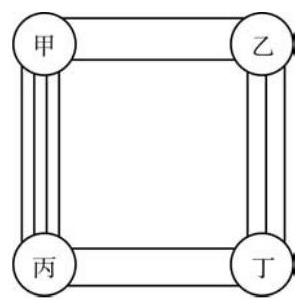

# 例题卡：例 5 如图 6-1-2, 从甲地到乙地有 2 条路, 从乙地到丁地有 3 条路; 从甲地到丙地有 4 条路, 从丙地到丁地有 2 条路. 那么, 从甲地到丁地, 如果每条路至多走一次, 且每个地点至多经过一次, 有多少种不同的走法?

例 5 如图 6-1-2, 从甲地到乙地有 2 条路, 从乙地到丁地有 3 条路; 从甲地到丙地有 4 条路, 从丙地到丁地有 2 条路. 那么, 从甲地到丁地, 如果每条路至多走一次, 且每个地点至多经过一次, 有多少种不同的走法?

解 从甲地到丁地的走法可以分成两类:

第一类:从甲地经由乙地到丁地. 这类走法可以分成两个步骤:先从甲地到乙地，有 2 种走法；再从乙地到丁地，有 3 种走法. 根据乘法原理, 这一类走法的种数为

$$
2 \times  3 = 6.
$$

第二类: 从甲地经由丙地到丁地. 这类走法可以分成两个步骤: 先从甲地到丙地, 有 4 种走法; 再从丙地到丁地, 有 2 种走法. 根据乘法原理, 这一类走法的种数为

$$
4 \times  2 = 8.
$$

根据加法原理，从甲地到丁地共有

$$
6 + 8 = {14}
$$

种不同的走法.
