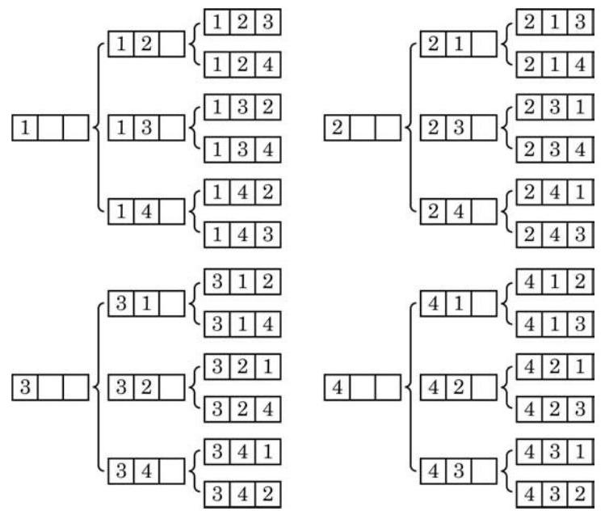

# 方法卡：1 排列的定义

考虑下面两个问题:

问题 1: 从甲、乙、丙 3 名学生中任选 2 名, 一名担任正班长, 另一名担任副班长. 有多少种不同的选法?

这个问题就是从甲、乙、丙 3 名学生中，每次任选 2 名，按照正班长在左、副班长在右的顺序排列, 求一共有多少种不同的排法.

首先确定正班长, 在 3 名学生中, 任选一名作为正班长, 有 3 种方法; 然后确定副班长, 当正班长选定后, 副班长就只能在其余的两人中选取, 有 2 种方法. 于是, 根据乘法原理, 从甲、 乙、丙 3 名学生中，每次任选 2 名，按照正班长在左、副班长在右的顺序排列的不同方法共有

$$
3 \times  2 = 6
$$

种, 即有 6 种不同的选法.

问题 1 是从 3 个不同的元素 $a\text{ 、 }b\text{ 、 }c$ 中任取 2 个,并按序排列, 求一共有多少种不同的排列方法. 所有的排列是

$$
{ab}\text{ 、 }{ac}\text{ 、 }{ba}\text{ 、 }{bc}\text{ 、 }{ca}\text{ 、 }{cb}\text{ . }
$$

这些排列的总数为 $3 \times  2 = 6$ .

问题 2: 已知抛物线的方程为 $y = a{x}^{2} + {bx} + c$ ,其中 $a\text{ 、 }b$ 、 $c \in  \{ 1,2,3,4\}$ ,且 $a\text{ 、 }b\text{ 、 }c$ 两两不同. 求这样的抛物线的个数.

这个问题就是从 4 个不同的数字中，每次任取 3 个不同的数字,按照 ${x}^{2}$ 的系数、 $x$ 的系数和常数项这样的顺序排列起来, 求一共有多少种不同的排法.

第一步,先确定 ${x}^{2}$ 的系数,从 $1\text{ 、 }2\text{ 、 }3\text{ 、 }4$ 这 4 个数字中任取 1 个, 有 4 种方法;

第二步,确定 $x$ 的系数,当 ${x}^{2}$ 的系数确定以后, $x$ 的系数只能从余下的 3 个数字中任取 1 个,有 3 种方法;

第三步,确定常数项,当 ${x}^{2}$ 的系数和 $x$ 的系数都确定以后, 常数项只能从余下的 2 个数字中任取 1 个, 有 2 种方法.

根据乘法原理, 从 4 个不同的数字中, 每次任取 3 个不同的数字,分别作为 ${x}^{2}$ 的系数、 $x$ 的系数和常数项的方法共有

$$
4 \times  3 \times  2 = {24}
$$

种. 具体方法如图 6-2-1 所示( ☐☐ ☐ 中的数字从左至右依次为 ${x}^{2}$ 的系数、 $x$ 的系数和常数项).

以上两个问题的共同点在于, 都是从若干个不同元素中选取部分 (或全部) 元素, 并按序排列, 求一共有多少种不同的排法.

定义 $M$ 几个互不相同的元素中,取出 $m\left( {m \leq  n}\right)$ 个不同元素按照一定的顺序排成一列,叫做从 $n$ 个元素中取出 $m$ 个元素的一个排列(permutation).

从排列的定义可以看出, 如果两个排列是相同的, 不仅组成这两个排列的元素完全相同, 而且排列的顺序也是完全相同的. 如果所取的元素不完全相同, 那么这两个排列是两个不同的排列 (如问题 1 中的 ${ab}$ 与 ${ac}$ ); 如果所取的元素完全相同,但排列顺序不同, 那么这两个排列也是不同的排列 (如问题 2 中的 3[2] 与 3[12]).
