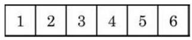

# 例题卡：例 2 将 6 本不同的书排成一排, 有多少种不同的排法?

例 2 将 6 本不同的书排成一排, 有多少种不同的排法?

解 考虑一排的 6 个位子(图 6-2-3). 将 6 本书排成一排, 相当于将这 6 本书分别放到这 6 个位子中, 这是将全部 6 个元素进行排列的问题.

从左至右将 6 个位子依次编号为 1 到 6 ，完成一个排列可以分为以下六个步骤:

第一步:确定放在 1 号位上的书，有 6 种方法；

第二步:确定放在 2 号位上的书，有 5 种方法；

第三步:确定放在 3 号位上的书，有 4 种方法；

第四步:确定放在 4 号位上的书，有 3 种方法；

第五步:确定放在 5 号位上的书，有 2 种方法；

第六步:确定放在 6 号位上的书, 有 1 种方法.

根据乘法原理, 不同的排法数为

$$
6 \times  5 \times  4 \times  3 \times  2 \times  1 = {720}.
$$

于是, 将 6 本不同的书排成一排, 有 720 种不同的排法.
