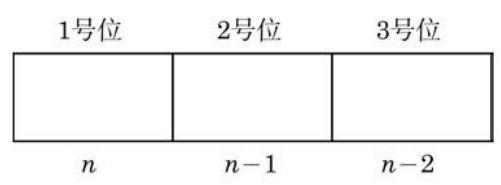
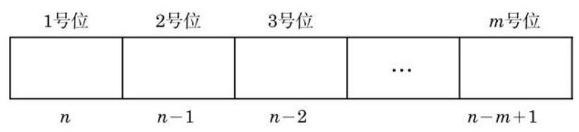

# 方法卡：2 排列数的计算

怎样计算从 $n$ 个不同元素中取出 $m$ 个元素的排列的个数? 一般地，我们有下面的定义:

定义 从 $n$ 个互不相同的元素中,取出 $m\left( {m \leq  n}\right)$ 个不同元素的所有排列的个数,叫做从 $n$ 个元素中取出 $m$ 个元素的排列数,用符号 ${\mathbf{P}}_{n}^{m}$ 表示.

---

P 是英文 permutation 的第一个字母. 在有些资料中也用符号 ${\mathrm{A}}_{n}^{m}$ 表示排列数.

---

例如,问题 1 中的选法数可以表示为 ${\mathrm{P}}_{3}^{2} = 6$ ; 问题 2 中的抛物线个数可以表示为 ${\mathrm{P}}_{4}^{3} = {24}$ . 下面研究排列数的计算公式.

求排列数 ${\mathrm{P}}_{n}^{3}$ ,可以这样考虑: 假定有排好顺序的 3 个位子 (图 6-2-4),从 $n$ 个互不相同的元素 ${a}_{1}\text{ 、 }{a}_{2}\text{ 、 }\cdots \text{ 、 }{a}_{n}$ 中任取 3 个填空, 一个位子填一个元素, 每一种填法就得到一个排列; 反过来, 任何一个排列都可以由这样的一种填法得到. 因此, 所有不同填法的总数就是排列数 ${\mathrm{P}}_{n}^{3}$ .

为了计算 ${\mathrm{P}}_{n}^{3}$ ,可以分成以下三个步骤:

第一步,确定 1 号位上的元素,这可以从 $n$ 个互不相同的元素中任取一个填空,有 $n$ 种方法;

第二步,确定 2 号位上的元素,这可以从剩下的 $n - 1$ 个互不相同的元素中任取一个填空,有 $n - 1$ 种方法;

第三步,确定 3 号位上的元素,这可以从剩下的 $n - 2$ 个互不相同的元素中任取一个填空,有 $n - 2$ 种方法.

根据乘法原理, 可以得到排列数为

$$
{\mathrm{P}}_{n}^{3} = n\left( {n - 1}\right) \left( {n - 2}\right) .
$$

同样,求 ${\mathrm{P}}_{n}^{m}$ ,可以这样考虑: 假定有排好顺序的 $m$ 个位子 (图 6-2-5),从 $n$ 个互不相同的元素 ${a}_{1}\text{ 、 }{a}_{2}\text{ 、 }\cdots \text{ 、 }{a}_{n}$ 中任取 $m$ 个填空, 一个位子填一个元素, 每一种填法就得到一个排列; 反过来, 任何一个排列都可以由这样的一种填法得到. 因此, 所有不同填法的总数就是排列数 ${\mathrm{P}}_{n}^{m}$ .

为了计算 ${\mathrm{P}}_{n}^{m}$ ,可以分成以下 $m$ 个步骤:

第一步,确定 1 号位上的元素,这可以从 $n$ 个互不相同的元素中任取一个填空,有 $n$ 种方法;

第二步,确定 2 号位上的元素,这可以从剩下的 $n - 1$ 个互不相同的元素中任取一个填空,有 $n - 1$ 种方法;

第三步，确定 3 号位上的元素，这可以从剩下的 $n - 2$ 个互不相同的元素中任取一个填空,有 $n - 2$ 种方法;

以此类推,当前面的 $m - 1$ 个位子都被填好后, $m$ 号位可以从余下的 $n - \left( {m - 1}\right)$ 个互不相同的元素中任取一个填空,有 $n - \; m + 1$ 种方法.

根据乘法原理, 可以得到排列数为

$$
{\mathrm{P}}_{n}^{m} = n\left( {n - 1}\right) \left( {n - 2}\right) \cdots \left( {n - m + 1}\right) ,
$$

其中 $m$ 及 $n$ 是正整数，且 $m \leq  n$ . 这个公式叫做排列数公式.
