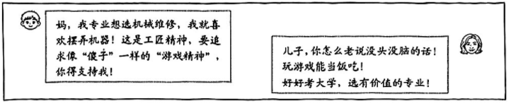

**2.按要求选择。（5分）**

小金围绕"金山农民画"（市级非遗）开展家乡文化调查，采访传承人陆师傅。以下是访谈实录节选：

小金：陆师傅，您好！金山农民画以"人物生动、色彩饱满"著称，（1）？

陆师傅：其实最早就是农民们农闲时画灶头画、门窗画，后来才慢慢发展成独立画种。

小金：（2）？

陆师傅：要懂农村生活——比如画插秧、晒谷，得知道农具怎么摆，人物姿态才真实，不然画出来就不像。

小金：（3）？

陆师傅：年轻人觉得传统图案太老气，我就试着加些动漫形象，没想到很受欢迎，还进了中小学美术课堂。

小金：（4）？

陆师傅：现在主要靠"师傅带徒"和"校园传承"，但好苗子不多，毕竟要沉下心观察生活、练习技法，不能急功近利。

**（1）将下列编号的语句分别填入访谈空白处，文意连贯的一项是（　）。（3分）**

①您觉得现在传承这门手艺，最大的挑战是什么

②这种独特风格的形成，和咱们的农村生活有什么联系呢

③您在创作中有没有做过创新，让农民画更能顺应时代的潮流

④要学好农民画，除了练习绘画技巧，还需要积累哪些方面的经验

A.②④③①　　B.④②①③　　C.②①④③　　D.②③④①

**（2）下列访谈提问，用词恰当且符合上文访谈情境的一项是（　）（2分）**

A.小金："陆师傅，您的作品色彩鲜艳，气势如虹，别具一格，有什么独特技巧吗？"

B.小金："陆师傅，现在流行数字艺术，农民画是昨日星辰，那就谈谈坚守的意义？"

C.小金："陆师傅，您对技艺传承有深刻体悟，能否多分享些基础性的学习要点？"

D.小金："陆师傅，您能否谈谈对当下短视频带货的盈利模式的看法？"

---

**第7题 情境写作（5分）**

以下是小金和妈妈之间的微信对话。请你结合本文内容，以小金的身份给妈妈再发一段微信文字，争取妈妈的认可与支持。

