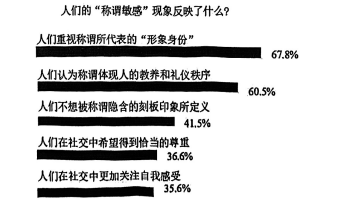

## （一）阅读下文，完成第3—7题。(17分)

某中学学生会发现校园内称呼风气混杂，有的同学用“老板”称呼老师，有的用“美女”“帅哥”泛称同学，还有的以“哥”“姐”相称。针对这一现象，学生会进行了一番探究。

### 材料一

①跟语言学家或者分析哲学家不同，社会学家眼里的语言，远不是那么阳春白雪高大上，而是地地道道的下里巴人，因为他们最为关注的是普普通通的日常语言。台湾学者叶启政认为，生活在人群中的人们有着各自的生活经验感受以及对社会的特定看法，在这个意义上，“人人都是社会学家”。而所谓专业社会学家所做的工作是在纷乱的社会现象中寻找到一种秩序。这种秩序并非是命定的事实，而是人们从谜团中选择的一条道路或者一种说法，是他们“编织出来的一篇具有情节的故事而已”。因此社会学家只是作为“说故事者”编织着一个社会的图像。

②如此说来，语言对于作为故事讲述者的社会学家来说便具有非同小可的意义。在社会学家眼里，语言至少代表了两种功能：一是用来说故事的工具，比如专业的社会学概念、方法、模型等；二是据以编织故事的文本道具，比如某一事件过程中观察到的所有行动者的言行记录、被访者的口述文字、作为社会背景的日常语言等。前者是学科规范，后者才是本文感兴趣的焦点，即作为社会学故事建构来源的文本语言。

③在社会学主流的经验研究中，研究者与被研究者的分离一向被视为确保研究结果中立与客观的前提。但是自20世纪中叶以来，客观主义之风遭到质疑，后实证主义兴起，体现在方法论上，就是不排斥研究者的先见，关注被研究者的主体性，强调研究过程的历史性和情境性，并对研究者与被研究者之间的关系进行反思，认定纯粹的、价值中立的语言的虚妄。而在这个过程中需要细心探讨的是：作为研究文本的日常语言在其中究竟扮演了怎样的角色?

④语言作为一种公共传播符号，其迷人之处，就在于跟文化之间纠缠不清的关系。一方面它包含着某种具有特定文化意涵的确定性和普遍性，其背后受到流行的价值观念或主流意识形态的支撑；另一方面语言又因其所处的不同历史、社会和事件情境而呈现出不同意涵，因而有“语境”之说。除此之外，语言不仅仅是内容的表征，更重要的是它所包含的讲述者的愿望期待或潜在意图，在这个意义上语言既是说者心声的表达，也是言外之意的流露或遮蔽。因此在公共舞台上，我们总能看到既有喧嚣的发言者，又有沉默的大多数，而社会学家正是从这些喧嚣和沉默的不同表现类型中探知其背后所隐藏的权力关系。

⑤然而最能体现语言的方法论魅力的还是话语分析。这一分析模式可以将语言、性别、权力这些似乎没有直接关联的东西，拼接出一幅完整的社会图景。例如针对百年来中国社会流行文化中对于男性和女性的称呼进行梳理，就不难发现一个性别权力关系的变迁框架图。在这个框架图中，阶级、阶层的痕迹清晰可见，从先生、女士、太太、小姐到高富帅、屌丝、单身狗等；意识形态也无所不在，从同志、妇女到男生、女生，从男子汉、贤妻良母到老板、美女，从男神、女神到暖男、女汉子，直至小鲜肉、直男癌……这些来自日常生活、民间流传甚至网民生创的词汇，描画了一幅与性别意识相关的常识变迁图，提供了观察社会整体变迁的独特窗口。

（选自吴小英《社会学中语言何为？》，有删改）

### 材料二

①曾几何时，一声“同志”便可，听者坦然、舒泰。后来，“先生”“小姐”“老板”满天飞，尤其是“小姐”常给人轻薄之感。如今，“小姐”似乎被“美女”取代，后者也逐渐失掉了赞美之意，变成了泛称。

②称呼自有其潮流，随时代而动。“同志”在讲究人人平等的年代被长久使用，有志同道合之感。“师傅”我沿用至今，倍觉亲切。年轻时在机务段当学徒，早几天入行的师兄师姐，我见了一律得叫“师傅”。在技术一线，学艺是头等大事，称呼关乎传道授业的礼仪。“师傅”是对有一技之长者的尊称，也是对德厚者的敬重。

③而“老师”则有些叫滥了。为人师表者本应必备的德与能不具备，叫与被叫却心安理得。“老师”“先生”应有门槛，否则难免有言语贿赂之嫌。

④遇事找警察，这时人们一般定要叫一声“同志”，不会唐突称“帅哥”“美女”。情急之下，人们的基本共识还在：唯有实在、得体才受欢迎。

⑤有的官员嫌称呼不够威风，便有人投其所好，“头儿”“老大”“老板”叫得脆响。被叫者欣然接受，久之则滋生居高临下的畸形心态，忘却“公仆”职责，胡作非为。称呼中糖衣炮弹的威力，不可不防。

⑥一位在公社工作近十载的干部调离，乡里田舍翁代表乡亲作诗送别。这位干部曾任公社党委秘书，自排官气、平易近人，为乡亲办了实事。乡亲平日只称一声“陈秘书”，朴实直白。离任之日乡亲赋句赠别，寻常称呼才包含深厚情感，称呼越是直白，感情越是亲近。

⑦称呼既关乎交往礼仪，也关涉社会风气的诚实或轻浮。近年来呼吁“同志”重归主流，是社会风气重归淳朴的表现。称呼中的真情实感，值得追求、颂扬。

（选自《人民日报》2025年07月07日，有删改）

### 材料三

在中国青年报社社会调查中心联合问卷网对1336名受访者进行的一项调查中，关于“人们的‘称谓敏感’现象反映了什么？”这一问题，调查结果如下：

