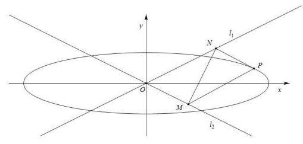

(3) 设 $P\left( {{x}_{0},{y}_{0}}\right)$ ,则 ${l}_{PM} : y - {y}_{0} = \frac{1}{2}\left( {x - {x}_{0}}\right) ,{l}_{PN} : y - {y}_{0} =  - \frac{1}{2}\left( {x - {x}_{0}}\right)$ ,

联立 $\left\{  \begin{array}{l} y - {y}_{0} = \frac{1}{2}\left( {x - {x}_{0}}\right) \\  y =  - \frac{1}{2}x \end{array}\right.$ ,解得: $x = \frac{{x}_{0}}{2} - {y}_{0}, y =  - \frac{{x}_{0}}{4} + \frac{{y}_{0}}{2}$ ,

即 $M\left( {\frac{{x}_{0}}{2} - {y}_{0}, - \frac{{x}_{0}}{4} + \frac{{y}_{0}}{2}}\right)$ ,

联立 $\left\{  \begin{array}{l} y - {y}_{0} =  - \frac{1}{2}\left( {x - {x}_{0}}\right) \\  y = \frac{1}{2}x \end{array}\right.$ ,解得: $x = \frac{{x}_{0}}{2} + {y}_{0}, y = \frac{{x}_{0}}{4} + \frac{{y}_{0}}{2}$ ,

即 $N\left( {\frac{{x}_{0}}{2} + {y}_{0},\frac{{x}_{0}}{4} + \frac{{y}_{0}}{2}}\right)$ ,

因为点 $P$ 在椭圆上,满足 $\frac{{x}_{0}^{2}}{{a}^{2}} + \frac{{y}_{0}^{2}}{4} = 1$ ,

所以 $\left| {MN}\right|  = \sqrt{4{y}_{0}^{2} + \frac{{x}_{0}^{2}}{4}} = \sqrt{4 \times  4 \times  \left( {1 - \frac{{x}_{0}^{2}}{{a}^{2}}}\right)  + \frac{{x}_{0}^{2}}{4}} = \sqrt{{16} + \left( {\frac{1}{4} - \frac{16}{{a}^{2}}}\right) {x}_{0}^{2}}$

因为 $\left| {MN}\right|$ 为定值,所以与 ${x}_{0}$ 无关,所以 $\frac{1}{4} - \frac{16}{{a}^{2}} = 0$ ,得 ${a}^{2} = {64}$ ,则 $a = 8$ ;

此时 $\left| {MN}\right|  = 4$ ,

如图: 由条件可知, $\tan \angle {NOx} = \frac{1}{2}$ ,则 $\cos \angle {NOx} = \frac{2}{\sqrt{5}} = \frac{2\sqrt{5}}{5}$ ,

$\cos \angle {MON} = \cos \left( {\pi  - 2\angle {NOx}}\right)  =  - \cos 2\angle {NOx} = 1 - 2{\cos }^{2}\angle {NOx} =  - \frac{3}{5}$ ,

则 $\sin \angle {MON} = \frac{4}{5}$ ，且 $\left| {MN}\right|$ 为定值 4,

$\bigtriangleup {MON}$ 中根据余弦定理, ${\left| MN\right| }^{2} = {\left| OM\right| }^{2} + {\left| ON\right| }^{2} - 2\left| {OM}\right| \left| {ON}\right| \cos \angle {MON}$ ,

$= {\left| OM\right| }^{2} + {\left| ON\right| }^{2} + \frac{6}{5}\left| {OM}\right| \left| {ON}\right|  \geq  \frac{16}{5}\left| {OM}\right| \left| {ON}\right| ,$

即 $\left| {OM}\right| \left| {ON}\right|  \leq  5$ ,所以 ${S}_{\bigtriangleup {MON}} = \frac{1}{2}\left| {OM}\right| \left| {ON}\right| \sin \angle {MON} \leq  2$ ,

而四边形 ${ONPM}$ 是平行四边形， ${S}_{\square {ONPM}} = 2{S}_{\bigtriangleup {MON}} \leq  4$ ，当 $\left| {OM}\right|  = \left| {ON}\right|$ 时等号成立，

此时, 四边形 ONPM 的最大值为 4 ,

如下图: 由以上可知, $\cos \angle {MON} = \frac{3}{5},\left| {MN}\right|  = 4$ ,

$\bigtriangleup {MON}$ 中根据余弦定理, ${\left| MN\right| }^{2} = {\left| OM\right| }^{2} + {\left| ON\right| }^{2} - 2\left| {OM}\right| \left| {ON}\right| \cos \angle {MON}$ , $= {\left| OM\right| }^{2} + {\left| ON\right| }^{2} - \frac{6}{5}\left| {OM}\right| \left| {ON}\right|  \geq  \frac{4}{5}\left| {OM}\right| \left| {ON}\right|$ ,

即 $\left| {OM}\right| \left| {ON}\right|  \leq  {20}$ ,所以 ${S}_{\bigtriangleup {MON}} = \frac{1}{2}\left| {OM}\right| \left| {ON}\right| \sin \angle {MON} \leq  8$ , 而四边形 ${ONPM}$ 是平行四边形, ${S}_{\square {ONPM}} = 2{S}_{\bigtriangleup {MON}} \leq  {16}$ , 当 $\left| {OM}\right|  = \left| {ON}\right|$ 时等号成立,

综上两种情况可知,四边形 ${ONPM}$ 的最大值为 16 .
