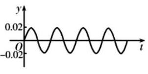

15. 音乐，是人类精神通过无意识计算而获得的愉悦享受，1807 年法国数学家傅里叶发现代表任何周期性声音的公式是形如 $y = A\sin {wx}$ 的简单正弦型函数之和,而且这些正弦型函数的频率都是其中一个最小频率的整数倍,比如用小提琴演奏的某音叉的声音图象是由下图1,2,3三个函数图象组成的,则小提琴演奏的该音叉的声音函数可以为( )

音叉

图1

图2

图3

A. $f\left( t\right)  = {0.06}\sin {1000\pi t} + {0.02}\sin {1500\pi t} + {0.01}\sin {3000\pi t}$

B. $f\left( t\right)  = {0.06}\sin {500\pi t} + {0.02}\sin {2000\pi t} + {0.01}\sin {300\pi t}$

C. $f\left( t\right)  = {0.06}\sin {1000\pi t} + {0.02}\sin {2000\pi t} + {0.01}\sin {3000\pi t}$

D. $f\left( t\right)  = {0.06}\sin {1000\pi t} + {0.02}\sin {2500\pi t} + {0.01}\sin {3000\pi t}$
