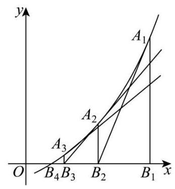

21. 设定义域为 $\left( {0, + \infty }\right)$ 的函数 $y = f\left( x\right)$ 的表达式为 $f\left( x\right)  = {\mathrm{e}}^{x} - a\left( {a > 0}\right)$ ,我们可以证明函数 $y = f\left( x\right)$ 存在唯一的零点,设该零点为 $r$ . 如图,过点 ${A}_{1}\left( {{x}_{1}, f\left( {x}_{1}\right) }\right)$ 作函数 $y = f\left( x\right)$ 的切线 ${l}_{1}$ 与 $x$ 轴的交点为 ${B}_{2}$ ,设横坐标为 ${x}_{2}$ ,若 ${x}_{2} > r$ ,则过点 ${A}_{2}\left( {{x}_{2}, f\left( {x}_{2}\right) }\right)$ 作函数 $y = f\left( x\right)$ 的切线 ${l}_{2}$ 与 $x$ 轴的交点为 ${B}_{3}$ ,设横坐标为 ${x}_{3}$ ; 若 ${x}_{2} \leq  r$ ,则停止作切线. ...依次类推,得到数列 $\left\{  {x}_{n}\right\}  \left( {n \geq  1, n \in  \mathbf{N}}\right)$ ,记 ${x}_{1} = t, t > r$ .

(1)若 $a = \mathrm{e}, t = 2$ ,求 ${x}_{2}$ ;
