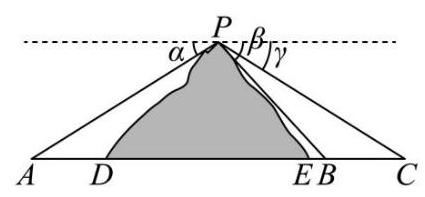

11. 如图所示, $A, B, C$ 为山脚两侧共线的三点,在山顶 $P$ 处测得三点的俯角分别为 $\alpha  = {29.3}^{ \circ  },\beta  = {38.2}^{ \circ  }$ , $\gamma  = {25.1}^{ \circ  }$ . 计划沿直线 ${AC}$ 开通穿山隧道,为了求出隧道 ${DE}$ 的长度,还测得 ${AD} = {277}$ 米, ${BE} = {49}$ 米, ${BC} = {320}$ 米,则根据以上数据，隧道 ${DE}$ 的长度约为___米.(结果精确到 1 米)

