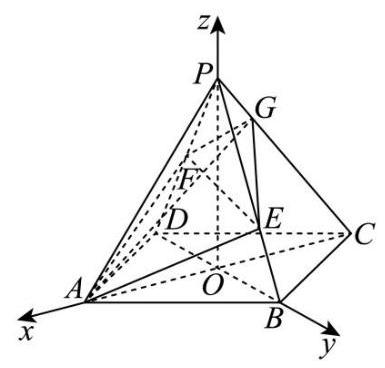
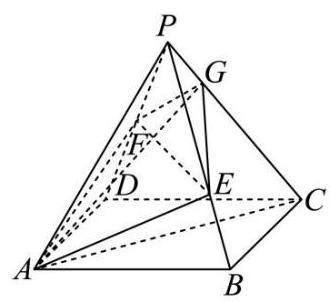

19. 在四棱锥 $P - {ABCD}$ 中，四边形 ${ABCD}$ 是菱形， ${PA} = {PC} = 5$ ， ${PB} = {PD} = 2\sqrt{5}$ ， ${AC} = 6$ ，点 $F$ 为 ${PD}$ 的中点,点 $E$ 为 ${PB}$ 上的点, $\overrightarrow{PE} = \lambda \overrightarrow{PB},\lambda  \in  \left( {0,1}\right)$ ,平面 ${AFE}$ 与棱 ${PC}$ 交于点 $G$ .

图1

图2

(1)求证:异面直线 ${EF}$ 与 ${AC}$ 垂直；
