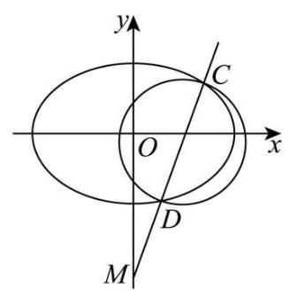

(1) 由题意可得 $\left\{  \begin{array}{l} \frac{c}{a} = \frac{\sqrt{2}}{2} \\  \frac{1}{{b}^{2}} = 1 \\  {a}^{2} = {b}^{2} + {c}^{2} \end{array}\right.$ ,解得 $\left\{  \begin{array}{l} a = \sqrt{2} \\  b = 1 \\  c = 1 \end{array}\right.$ ,

故椭圆 $\Gamma$ 的方程为 $\frac{{x}^{2}}{2} + {y}^{2} = 1$ ;

(2)由 $m = 2$ ，则 $M\left( {0, - 2}\right)$ ，可设 $l : y = {kx} - 2$ ， $C\left( {{x}_{1},{y}_{1}}\right)$ ， $D\left( {{x}_{2},{y}_{2}}\right)$ ，

则由直线 $l$ 与 ${x}^{2} + {y}^{2} = \frac{2}{3}$ 相切,可得 $\frac{\left| -2\right| }{\sqrt{{k}^{2} + 1}} = \sqrt{\frac{2}{3}}$ ,化简得 ${k}^{2} = 5$ ,

联立 $\left\{  \begin{array}{l} y = {kx} - 2 \\  \frac{{x}^{2}}{2} + {y}^{2} = 1 \end{array}\right.$ ,消去 $y$ 可得 $\left( {2{k}^{2} + 1}\right) {x}^{2} - {8kx} + 6 = 0$ ,

$\Delta  = {\left( -8k\right) }^{2} - 4\left( {2{k}^{2} + 1}\right)  \times  6 = {16}{k}^{2} - {24} = {16} \times  5 - {24} = {56} > 0,$

则 ${x}_{1} + {x}_{2} = \frac{8k}{2{k}^{2} + 1},{x}_{1}{x}_{2} = \frac{6}{2{k}^{2} + 1}$ ,

则 $\left| {CD}\right|  = \sqrt{{k}^{2} + 1} \cdot  \sqrt{{\left( {x}_{1} + {x}_{2}\right) }^{2} - 4{x}_{1}{x}_{2}} = \sqrt{{k}^{2} + 1} \cdot  \sqrt{{\left( \frac{8k}{2{k}^{2} + 1}\right) }^{2} - 4 \times  \frac{6}{2{k}^{2} + 1}} \; = \frac{\sqrt{{k}^{2} + 1}}{2{k}^{2} + 1} \cdot  \sqrt{{16}{k}^{2} - {24}} = \frac{2\sqrt{2} \cdot  \sqrt{{k}^{2} + 1} \cdot  \sqrt{2{k}^{2} - 3}}{2{k}^{2} + 1} \; = \frac{2\sqrt{2} \times  \sqrt{5 + 1} \times  \sqrt{2 \times  5 - 3}}{2 \times  5 + 1} = \frac{4\sqrt{21}}{11};$

(3) 设 $l : y = {kx} - m, C\left( {{x}_{1},{y}_{1}}\right) \text{ 、 }D\left( {{x}_{2},{y}_{2}}\right) , P\left( {s, t}\right) \left( {t > 0}\right)$ ,

联立 $\left\{  \begin{array}{l} y = {kx} - m \\  \frac{{x}^{2}}{2} + {y}^{2} = 1 \end{array}\right.$ ,消去 $y$ 可得 $\left( {2{k}^{2} + 1}\right) {x}^{2} - {4kmx} + 2{m}^{2} - 2 = 0$ ,

$\Delta  = {\left( -4km\right) }^{2} - 4\left( {2{k}^{2} + 1}\right) \left( {2{m}^{2} - 2}\right)  = {16}{m}^{2}{k}^{2} - {16}{m}^{2}{k}^{2} + 8 - 8{m}^{2} + {16}{k}^{2}$

$= 8 - 8{m}^{2} + {16}{k}^{2} > 0$ ,即 $2{k}^{2} - {m}^{2} + 1 > 0$ ,

${x}_{1} + {x}_{2} = \frac{4km}{2{k}^{2} + 1},\;{x}_{1}{x}_{2} = \frac{2{m}^{2} - 2}{2{k}^{2} + 1},$

由点 $P$ 在以 ${CD}$ 为直径的圆上,则 $\overrightarrow{PC} \cdot  \overrightarrow{PD} = 0$ ,

由 $\overrightarrow{PC} = \left( {{x}_{1} - s,{y}_{1} - t}\right) ,\overrightarrow{PD} = \left( {{x}_{2} - s,{y}_{2} - t}\right)$ ,

则 $\overrightarrow{PC} \cdot  \overrightarrow{PD} = \left( {{x}_{1} - s}\right) \left( {{x}_{2} - s}\right)  + \left( {{y}_{1} - t}\right) \left( {{y}_{2} - t}\right)$

$$
= {x}_{1}{x}_{2} - s\left( {{x}_{1} + {x}_{2}}\right)  + {s}^{2} + {y}_{1}{y}_{2} - t\left( {{y}_{1} + {y}_{2}}\right)  + {t}^{2}
$$

$$
= {x}_{1}{x}_{2} - s\left( {{x}_{1} + {x}_{2}}\right)  + {s}^{2} + \left( {k{x}_{1} - m}\right) \left( {k{x}_{2} - m}\right)  - t\left( {k{x}_{1} - m + k{x}_{2} - m}\right)  + {t}^{2}
$$

$$
= \left( {{k}^{2} + 1}\right) {x}_{1}{x}_{2} - \left( {s + {km} + {tk}}\right) \left( {{x}_{1} + {x}_{2}}\right)  + {s}^{2} + {t}^{2} + {m}^{2} + {2tm}
$$

$$
= \frac{\left( {2{m}^{2} - 2}\right) \left( {{k}^{2} + 1}\right) }{2{k}^{2} + 1} - \frac{{4km}\left( {s + {km} + {tk}}\right) }{2{k}^{2} + 1} + \frac{\left( {{s}^{2} + {t}^{2} + {m}^{2} + {2tm}}\right) \left( {2{k}^{2} + 1}\right) }{2{k}^{2} + 1}
$$

$$
= \frac{-2{k}^{2} + 3{m}^{2} - 2 - {4kms} + 2{k}^{2}{s}^{2} + 2{k}^{2}{t}^{2} + {s}^{2} + {t}^{2} + {2tm}}{2{k}^{2} + 1}
$$

$$
= \frac{\left( {2{t}^{2} + 2{s}^{2} - 2}\right) {k}^{2} - {4msk} + 3{m}^{2} + {s}^{2} + {t}^{2} + {2tm} - 2}{2{k}^{2} + 1} = 0,
$$

即 $\left( {2{t}^{2} + 2{s}^{2} - 2}\right) {k}^{2} - {4msk} + 3{m}^{2} + {s}^{2} + {t}^{2} + {2tm} - 2 = 0$

故 $\left\{  \begin{array}{l} 2{t}^{2} + 2{s}^{2} - 2 = 0 \\   - {4s} = 0 \\  3{m}^{2} + {s}^{2} + {t}^{2} + {2tm} - 2 = 0 \end{array}\right.$ ,则有 $\left\{  \begin{array}{l} s = 0 \\  {t}^{2} = 1 \\  3{m}^{2} + {2tm} - 1 = 0 \end{array}\right.$ ,

由 $t > 0$ ,故 $t = 1$ ,则有 $3{m}^{2} + {2m} - 1 = \left( {{3m} - 1}\right) \left( {m + 1}\right)  = 0$ ,

即 $m = \frac{1}{3}$ 或 $m =  - 1$ ,由 $m > 0$ ,故 $m = \frac{1}{3}$ ,

即当且仅当 $m = \frac{1}{3}$ 时,以 ${CD}$ 为直径的圆经过 $x$ 轴上方的定点 $P$ ,

且 $P$ 点坐标为 $\left( {0,1}\right)$ .
