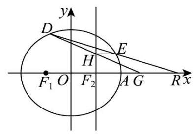

(1) 记椭圆 $C : \frac{{x}^{2}}{4} + \frac{{y}^{2}}{3} = 1$ 的长轴长为 ${2a}$ ,短轴长为 ${2b}$ ,焦距为 ${2c}$ ,

则 $a = 2, b = \sqrt{3}, c = \sqrt{{a}^{2} - {b}^{2}} = 1$ ,所以离心率 $e = \frac{c}{a} = \frac{1}{2}$ .

(2)由题知， $A\left( {2,0}\right)$ ，设 $M\left( {0, m}\right) , m > 0$ ， $P\left( {{x}_{P},{y}_{P}}\right)$ ，

因为 $\overrightarrow{AP} = \left( {{x}_{P} - 2,{y}_{P}}\right) ,\overrightarrow{PM} = \left( {-{x}_{P}, m - {y}_{P}}\right) ,\overrightarrow{AP} = 2\overrightarrow{PM}$ ,

所以 $\left( {{x}_{P} - 2,{y}_{P}}\right)  = 2\left( {-{x}_{P}, m - {y}_{P}}\right)$ ,得 ${x}_{P} = \frac{2}{3},{y}_{P} = \frac{2m}{3}$ ,

代入椭圆方程得 $\frac{1}{9} + \frac{4{m}^{2}}{27} = 1$ ，解得 $m = \sqrt{6}$ (负根舍去)

(3)易知，当直线 ${DE}$ 斜率为 0 时， $D, E$ 为长轴端点， $H$ 与右焦点重合，满足题意；

设直线 ${DE}$ 的方程为 $x = {ny} + 4, D\left( {{x}_{1},{y}_{1}}\right) , E\left( {{x}_{2},{y}_{2}}\right)$ ,

联立 $\left\{  \begin{array}{l} \frac{{x}^{2}}{4} + \frac{{y}^{2}}{3} = 1 \\  x = {ny} + 4 \end{array}\right.$ 得: $\left( {3{n}^{2} + 4}\right) {y}^{2} + {24ny} + {36} = 0$ ,

由 $\Delta  = {\left( {24}n\right) }^{2} - 4\left( {3{n}^{2} + 4}\right)  \times  {36} = {144}\left( {{n}^{2} - 4}\right)  > 0$ 得 $n <  - 2$ 或 $n > 2$ ,

则 ${y}_{1} + {y}_{2} = \frac{-{24n}}{3{n}^{2} + 4},{y}_{1}{y}_{2} = \frac{36}{3{n}^{2} + 4}$ ,

所以 $3\left( {{y}_{1} + {y}_{2}}\right)  =  - {2n}{y}_{1}{y}_{2}$ ,则 ${y}_{2} = \frac{-3{y}_{1}}{3 + {2n}{y}_{1}}$ ,

设 $H\left( {1, h}\right)$ ,因为 $D, H, G$ 三点共线,则 $\overrightarrow{DH}//\overrightarrow{HG},\overrightarrow{DH} = \left( {1 - {x}_{1}, h - {y}_{1}}\right) ,\overrightarrow{HG} = \left( {\frac{3}{2}, - h}\right)$ ,

所以 $- h\left( {1 - {x}_{1}}\right)  = \frac{3}{2}\left( {h - {y}_{1}}\right)$ ,则 $h = \frac{3{y}_{1}}{5 - 2{x}_{1}} = \frac{3{y}_{1}}{5 - 2\left( {n{y}_{1} + 4}\right) } = \frac{-3{y}_{1}}{3 + {2n}{y}_{1}}$ ,

所以 $h = {y}_{2}$ ,所以 ${EH} \bot  y$ 轴.
