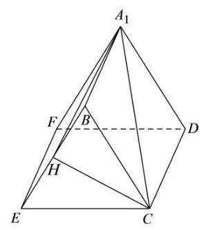

(2)因为长方形 ${ABCD}$ 中，点 $E$ 、 $F$ 分别为边 ${BC}$ 、 ${AD}$ 的中点，

故 ${EF} \bot  {A}_{1}F,{EF} \bot  {DF}$ ,二面角 ${A}_{1} - {EF} - D$ 的平面角为 $\angle {A}_{1}{FD}$ ,即 $\angle {A}_{1}{FD} = {60}^{ \circ  }$ ,

又 ${AB} = 2,{BC} = 4$ ,所以 ${A}_{1}F = {DF} = 2,\bigtriangleup {A}_{1}{FD}$ 为等边三角形,

同理可得 $\bigtriangleup  {BCE}$ 为等边三角形，

取 ${BE}$ 的中点 $H$ ，连接 ${CH},{A}_{1}H$ ，则 ${CH} \bot  {BE}$ ，

又 ${EF} \bot$ 平面 ${BEC}$ ， ${CH} \subset$ 平面 ${BEC}$ ，故 ${EF} \bot  {CH}$ ，

因为 ${BE} \cap  {EF} = E,{BE},{EF} \subset$ 平面 ${A}_{1}{BEF}$ ,故 ${CH} \bot$ 平面 ${A}_{1}{BEF}$ ,

故直线 $C{A}_{1}$ 与平面 ${A}_{1}{BEF}$ 所成角为 $\angle H{A}_{1}C$ ,

${EH} = {BH} = 1,\angle {BEC} = {60}^{ \circ  }$ ,故 ${CH} = \sqrt{3}$ ,由勾股定理得 ${A}_{1}H = \sqrt{{A}_{1}{B}^{2} + B{H}^{2}} = \sqrt{5}$ ,

则 $\tan \angle H{A}_{1}C = \frac{HC}{{A}_{1}H} = \frac{\sqrt{3}}{\sqrt{5}} = \frac{\sqrt{15}}{5}$ ,

直线 $C{A}_{1}$ 与平面 ${A}_{1}{BEF}$ 所成角的大小为 $\arctan \frac{\sqrt{15}}{5}$ .
