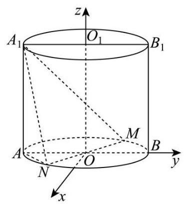

18. 如图,圆柱 $O{O}_{1}$ 的轴截面 ${AB}{B}_{1}{A}_{1}$ 是边长为 4 的正方形, ${MN}$ 为底面圆 $O$ 的一条直径,且 $\angle {BOM} = \frac{\pi }{3}$ .

(1)求异面直线 ${A}_{1}N$ 与 $B{B}_{1}$ 所成角的大小(用反三角表示);

(2)求点 $A$ 到平面 ${A}_{1}{MN}$ 的距离.
