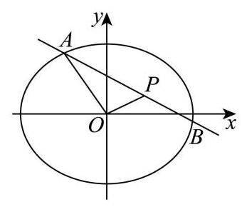

(3)设过 $P\left( {2,1}\right)$ 的直线 ${AB}$ 参数方程为 $\left\{  \begin{array}{l} x = 2 + t\cos \alpha \\  y = 1 + t\sin \alpha  \end{array}\right.$ ( $t$ 为参数)， 代入椭圆方程整理得: $\left( {{\cos }^{2}\alpha  + 4{\sin }^{2}\alpha }\right) {t}^{2} + \left( {4\cos \alpha  + 8\sin \alpha }\right) t - 8 = 0$ ， 由参数 $t$ 的几何意义得 $\left| {PA}\right|  \cdot  \left| {PB}\right|  = \left| {{t}_{1}{t}_{2}}\right|$ , 结合韦达定理得: $\left| {PA}\right|  \cdot  \left| {PB}\right|  = \left| \frac{-8}{{\cos }^{2}\alpha  + 4{\sin }^{2}\alpha }\right|  = \frac{8}{1 + 3{\sin }^{2}\alpha }$ ， 斜率存在时,设斜率为 $k = \tan \alpha$ ,化简得 $\left| {PA}\right|  \cdot  \left| {PB}\right|  = 2 + \frac{6}{1 + 4{k}^{2}}$ ,

由 ${k}^{2} \geq  0$ 得: 当 $k = 0$ 时, $\left| {PA}\right|  \cdot  \left| {PB}\right|$ 取得最大值 8,对应直线方程为 $y = 1$ ;

当直线斜率不存在时,直线为 $x = 2$ ,此时 $\left| {PA}\right|  \cdot  \left| {PB}\right|  = 2$ ,为最小值.

综上, $\left| {PA}\right|  \cdot  \left| {PB}\right|$ 的最大值为 8,对应直线方程为 $y = 1$ ; 最小值为 2,对应直线方程为 $x = 2$
