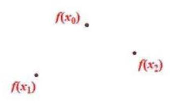

(1)对 $\forall {x}_{1},{x}_{2} \in  \left\lbrack  {0,1}\right\rbrack  ,\left| {f\left( {x}_{1}\right)  - f\left( {x}_{2}\right) }\right|  = \left| {\left( {{x}_{1}^{2} - {x}_{2}^{2}}\right)  - \left( {{x}_{1} - {x}_{2}}\right) }\right|  = \left| {{x}_{1} - {x}_{2}}\right|  \cdot  \left| {{x}_{1} + {x}_{2} - 1}\right|$
$\because {x}_{1} + {x}_{2} \in  \left\lbrack  {0,2}\right\rbrack  ,\;{x}_{1} + {x}_{2} - 1 \in  \left\lbrack  {-1,1}\right\rbrack  ,\;\left| {{x}_{1} + {x}_{2} - 1}\right|  \leq  1$
$\therefore \left| {f\left( {x}_{1}\right)  - f\left( {x}_{2}\right) }\right|  \leq  \left| {{x}_{1} - {x}_{2}}\right|$
$\therefore f\left( x\right)$ 属于集合 $\Omega$
(2) $\because M\left( {f,\left\lbrack  {0,1}\right\rbrack  }\right)  = 1$
$\therefore$ 存在 $u, v \in  \left\lbrack  {0,1}\right\rbrack$ ,满足 $\left| {f\left( u\right)  - f\left( v\right) }\right|  = 1$ (*)
$\because f\left( x\right)  \in  \Omega$
$\therefore \left| {f\left( u\right)  - f\left( v\right) }\right|  \leq  \left| {u - v}\right|$
$\therefore 1 \leq  \left| {u - v}\right|$
而 $u \in  \left\lbrack  {0,1}\right\rbrack  , v \in  \left\lbrack  {0,1}\right\rbrack$
$\therefore \left| {u - v}\right|  \leq  1$
$\therefore \left| {u - v}\right|  = 1$ ,即 $\{ u, v\}  = \{ 0,1\}$
又 $\because f\left( 0\right)  = 0$ ,结合 (*) 式, $\left| {f\left( 1\right)  - f\left( 0\right) }\right|  = 1$
$\therefore f\left( 1\right)  = 1$ 或 $f\left( 1\right)  =  - 1$
当 $f\left( 1\right)  = 1$ 时,由题意,对 $\forall x \in  \left\lbrack  {0,1}\right\rbrack  ,\left| {f\left( x\right)  - f\left( 0\right) }\right|  \leq  x$ ,即 $f\left( x\right)  \leq  x$
$\left| {f\left( 1\right)  - f\left( x\right) }\right|  \leq  1 - x,$ 即 $1 - f\left( x\right)  \leq  1 - x,$ 即 $f\left( x\right)  \geq  x$
$\therefore f\left( x\right)  = x$
当 $f\left( 1\right)  =  - 1$ 时,同理, $f\left( x\right)  =  - x$

综上, $f\left( 1\right)  = 1$ 或 $- 1, f\left( x\right)  = x$ 或 $f\left( x\right)  =  - x$
(3)必要性:不妨设 $y = f\left( x\right)$ 在 $\lbrack 0, + \infty )$ 上递增
$$
g\left( x\right)  = f\left( x\right)  - f\left( 0\right)
$$
$g\left( {x}_{2}\right)  = f\left( {x}_{2}\right)  - f\left( 0\right)  - f\left( {x}_{1}\right)  + f\left( 0\right)  = f\left( {x}_{2}\right)  - f\left( {x}_{1}\right)  = M\left( {f,\left\lbrack  {{x}_{1},{x}_{2}}\right\rbrack  }\right)$
充分性: 假设 $y = f\left( x\right)$ 在 $\lbrack 0, + \infty )$ 上不单调
则存在 ${x}_{1} < {x}_{0} < {x}_{2}$ ,使得 $f\left( {x}_{1}\right)  < f\left( {x}_{0}\right)  > f\left( {x}_{2}\right)$
或 $f\left( {x}_{1}\right)  > f\left( {x}_{0}\right)  < f\left( {x}_{2}\right)$
不妨设 $f\left( {x}_{1}\right)  < f\left( {x}_{0}\right)  > f\left( {x}_{2}\right)$ ,且 $f\left( {x}_{0}\right)$ 是 $y = f\left( x\right)$ 在 $\left\lbrack  {{x}_{1},{x}_{2}}\right\rbrack$ 上的最大值
设 $y = f\left( x\right)$ 在 $\left\lbrack  {{x}_{1},{x}_{0}}\right\rbrack$ 上的最小值为 ${L}_{1}$ ,在 $\left\lbrack  {{x}_{0},{x}_{2}}\right\rbrack$ 上的最小值为 ${L}_{2}$
由题, $M\left( {f,\left\lbrack  {{x}_{1},{x}_{0}}\right\rbrack  }\right)  = g\left( {x}_{0}\right)  - g\left( {x}_{1}\right) , M\left( {f,\left\lbrack  {{x}_{0},{x}_{2}}\right\rbrack  }\right)  = g\left( {x}_{2}\right)  - g\left( {x}_{0}\right)$
$\therefore M\left( {f,\left\lbrack  {{x}_{1},{x}_{0}}\right\rbrack  }\right)  + M\left( {f,\left\lbrack  {{x}_{0},{x}_{2}}\right\rbrack  }\right)  = g\left( {x}_{2}\right)  - g\left( {x}_{1}\right)  = M\left( {f,\left\lbrack  {{x}_{1},{x}_{2}}\right\rbrack  }\right)$
即 $f\left( {x}_{0}\right)  - {L}_{1} + f\left( {x}_{0}\right)  - {L}_{2} = f\left( {x}_{0}\right)  - \min \left\{  {{L}_{1},{L}_{2}}\right\}$
即 $f\left( {x}_{0}\right)  = {L}_{1} + {L}_{2} - \min \left\{  {{L}_{1},{L}_{2}}\right\}$ ,即 $f\left( {x}_{0}\right)  = \max \left\{  {{L}_{1},{L}_{2}}\right\}$
$\max \left\{  {{L}_{1},{L}_{2}}\right\}   \leq  \max \left\{  {f\left( {x}_{1}\right) , f\left( {x}_{2}\right) }\right\}   < f\left( {x}_{0}\right)$ ,矛盾
$\therefore$ 假设不成立, $y = f\left( x\right)$ 是 $\lbrack 0, + \infty )$ 上的单调函数
充要条件即得证
中国大陆 上海

