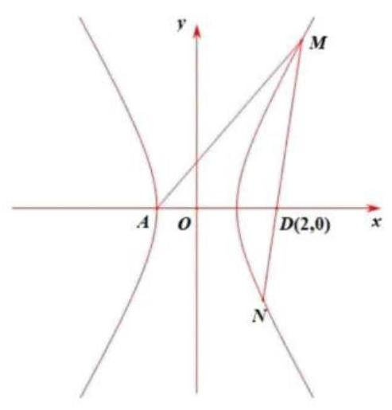

(2) ${x}^{2} - \frac{{y}^{2}}{3} = 1, A\left( {-1,0}\right) , D\left( {2,0}\right)$
设 $M\left( {{x}_{0},{y}_{0}}\right)$ ,易知 $\angle {MAD} \neq  {90}^{ \circ  }$
① $\angle {AMD} = {90}^{ \circ  }$
$\overrightarrow{AM} \cdot  \overrightarrow{DM} = 0$
即 $\left( {{x}_{0} + 1,{y}_{0}}\right)  \cdot  \left( {{x}_{0} - 2,{y}_{0}}\right)  = 0$
联立 $\left\{  \begin{array}{l} \left( {{x}_{0} + 1}\right) \left( {{x}_{0} + 2}\right)  + {y}_{0}{}^{2} = 0 \\  {x}_{0}^{2} - \frac{{y}_{0}{}^{2}}{3} = 1 \end{array}\right.$ ，解得 $\left\{  \begin{array}{l} {x}_{0} = \frac{5}{4} \\  {y}_{0} = \frac{3\sqrt{3}}{4} \end{array}\right.$ ，即 $M\left( {\frac{5}{4},\frac{3\sqrt{3}}{4}}\right)$ 此时 ${K}_{MD} =  - \sqrt{3} = K$ 渐
② $\angle {ADM} = {90}^{ \circ  }$
同理, $M\left( {2,3}\right)$
综上， $M\left( {2,3}\right)$ 或 $M\left( {\frac{5}{4},\frac{3\sqrt{3}}{4}}\right)$

