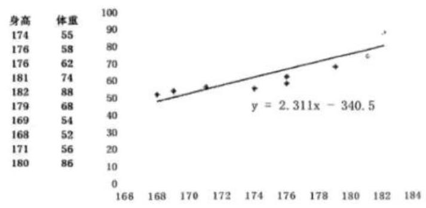

13. 某校学生会体育部长依据本校高三男生的身高（单位：cm）与体重（单位：kg）的抽样数据，运用电子办公软件求出了“体重” $y$ 关于“身高” $x$ 的回归方程，则该回归方程（ ）

A. 表示 $x$ 与 $y$ 之间的不确定关系
B. 表示 $x$ 与 $y$ 之间的不确定关系
C. 反映 $x$ 与 $y$ 之间的真实关系
D. 反映 $x$ 与 $y$ 之间的真实关系的一种最佳拟合
